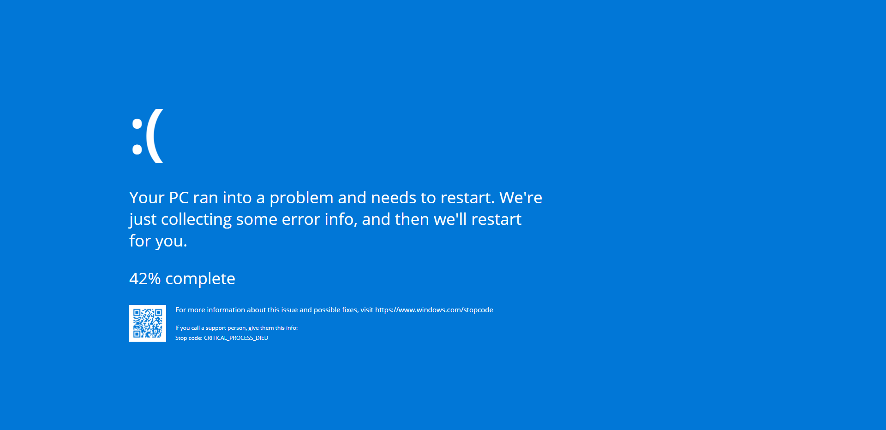

# Screen of death (Windows Blue screen)

---

## 

> Just a little fun project 😉

## Live Preview

Live Preview: [https://screen-of-death.vercel.app](https://screen-of-death.vercel.app)

_Tip: Run the app (or open the live preview) and press F11 (full screen)_

## License

Licensed under the [MIT](https://github.com/peter-stuhlmann/ScreenOfDeath/blob/master/LICENSE) license by [Peter R. Stuhlmann](https://peter-stuhlmann-webentwicklung.de).
